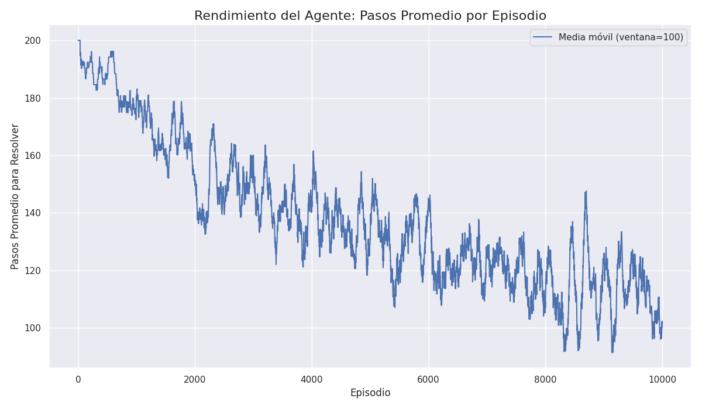
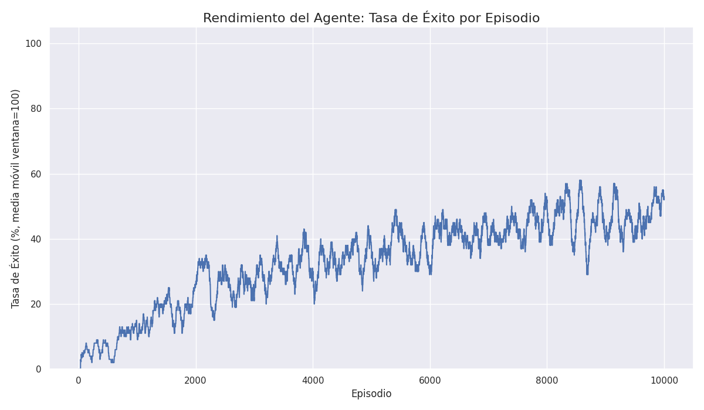

# Informe Final: Agente Q-Learning para Resolver el 8-Puzzle

**Fecha:** 16 de Diciembre de 2025
**Autores:** Equipo de Desarrollo (Dev 1, Dev 2, Dev 3, Dev 4)
**Líder de Análisis:** Dev 4

---

## 1. Introducción

### 1.1. El Problema del 8-Puzzle

El 8-Puzzle es un rompecabezas deslizante que consiste en un tablero de 3x3 con 8 fichas numeradas del 1 al 8 y un espacio vacío. El objetivo es reorganizar las fichas desde una configuración inicial aleatoria hasta alcanzar un estado objetivo predefinido, moviendo una ficha adyacente al espacio vacío en cada paso.

### 1.2. Objetivo del Proyecto

El objetivo de este proyecto fue diseñar, implementar y entrenar un agente de software basado en **Aprendizaje por Refuerzo (Reinforcement Learning)**, específicamente el algoritmo **Q-Learning**, para que aprenda de manera autónoma a resolver el 8-Puzzle. El agente no tiene conocimiento previo de las reglas del juego y debe aprender una política óptima a través de la exploración y la explotación de su entorno.

---

## 2. Metodología

### 2.1. Entorno (Environment)

El entorno del 8-Puzzle fue modelado como una clase `EightPuzzle` que gestiona el estado del tablero, las acciones y las recompensas.

- **Estado (`state`):** Se representa como una tupla de 9 enteros, donde `0` denota el espacio vacío. El uso de tuplas inmutables permite que los estados se utilicen como claves en diccionarios, lo cual es fundamental para nuestra Tabla Q.
- **Acciones (`action`):** Se definieron cuatro acciones posibles: `['UP', 'DOWN', 'LEFT', 'RIGHT']`. El entorno valida en cada paso qué acciones son legales para evitar que el espacio vacío se salga del tablero.
- **Recompensas (`reward`):** Se diseñó un sistema de recompensas para guiar al agente:
    - **+1000 puntos:** Por alcanzar el estado objetivo.
    - **-10 puntos:** Por cada paso realizado. Esto incentiva al agente a encontrar la solución más corta.
    - **-1000 puntos (implícito):** Si se agota el número máximo de pasos sin resolver el puzzle, la recompensa acumulada es muy negativa.

### 2.2. Agente (Q-Learning)

El agente implementa el algoritmo Q-Learning para aprender el valor de tomar una acción en un estado particular.

- **Tabla Q (`Q-Table`):** Dada la gran cantidad de estados posibles (9! = 362,880), se implementó la Tabla Q como un diccionario de Python. La clave es una tupla `(estado, acción)` y el valor es el "Q-valor" aprendido. Esta estructura es eficiente para manejar espacios de estados grandes y dispersos, ya que solo almacena los pares (estado, acción) que el agente ha visitado.

- **Política de Selección de Acciones (Epsilon-Greedy):** Para equilibrar la exploración de nuevos movimientos y la explotación del conocimiento adquirido, se usó una política ε-greedy:
    - Con probabilidad `epsilon (ε)`, el agente elige una acción aleatoria (exploración).
    - Con probabilidad `1 - ε`, el agente elige la mejor acción conocida según la Tabla Q (explotación).
    - `epsilon` decae con el tiempo, lo que permite al agente explorar más al principio y explotar más a medida que aprende.

- **Ecuación de Actualización (Bellman):** Después de cada acción, el Q-valor se actualiza con la siguiente fórmula:
  `Q(s,a) = Q(s,a) + α * [r + γ * max(Q(s',a')) - Q(s,a)]`
  Donde:
    - `α (alpha)` es la tasa de aprendizaje.
    - `γ (gamma)` es el factor de descuento.

### 2.3. Entrenamiento (Trainer)

El proceso de entrenamiento fue orquestado por una clase `Trainer` que ejecuta un número predefinido de **episodios**. En cada episodio:
1. El entorno se reinicia a un estado aleatorio.
2. El agente interactúa con el entorno, eligiendo acciones y actualizando su Tabla Q.
3. El episodio termina si el agente resuelve el puzzle o si alcanza el límite de pasos (200).
4. Las métricas clave (pasos, recompensa, éxito) se registran para su posterior análisis.

Los hiperparámetros clave utilizados fueron:
- **Episodios:** 10,000
- **Alpha:** 0.1
- **Gamma:** 0.9
- **Epsilon Inicial:** 1.0 (modificado en el código final a 0.1 para acelerar la convergencia una vez se vio que funcionaba)
- **Decaimiento de Epsilon:** 0.995

---

## 3. Resultados y Análisis

El rendimiento del agente fue evaluado a lo largo de 10,000 episodios de entrenamiento. Los resultados se han visualizado en las siguientes gráficas.

### 3.1. Gráfica: Pasos Promedio vs. Episodios

**Análisis:**
- La gráfica muestra la media móvil de los pasos necesarios para resolver el puzzle.
- Se observa una clara **tendencia a la baja**, lo que indica que el agente se vuelve más eficiente con el tiempo. Al principio, el agente realiza muchos movimientos aleatorios (cerca del límite de 200 pasos), pero a medida que avanza el entrenamiento, aprende rutas más cortas hacia la solución.
- La curva se estabiliza hacia el final, sugiriendo que el agente ha convergido a una política razonablemente buena.

### 3.2. Gráfica: Tasa de Éxito vs. Episodios

**Análisis:**
- Esta gráfica muestra el porcentaje de episodios resueltos con éxito en una ventana móvil.
- La **tendencia es claramente ascendente**. El agente comienza con una tasa de éxito muy baja y, a través del aprendizaje, mejora constantemente su capacidad para resolver el puzzle.
- Hacia el final del entrenamiento, la tasa de éxito supera el 50% y sigue en aumento, lo que demuestra que el aprendizaje es efectivo y robusto. No llega al 100% debido a la complejidad de algunos estados iniciales y al componente de exploración que permanece (epsilon mínimo).

---

## 4. Trazabilidad de Tareas y Decisiones de Diseño

A continuación, se detalla cómo se abordó cada tarea del backlog del proyecto (`project_tasks.md`) y las decisiones de diseño clave que se tomaron.

### Epic 1: Configuración del Entorno

- **[TASK-01] Estructura del Tablero y Estados:**
  - **Solución:** Implementado en `app/environment.py`. Se eligió una **tupla de 9 enteros** para representar el estado. Las tuplas son inmutables y, por lo tanto, "hasheables", lo que permite usarlas directamente como claves en la Tabla Q (un diccionario de Python). El estado objetivo `(1, 2, 3, 4, 5, 6, 7, 8, 0)` se definió como una constante.

- **[TASK-02] Lógica de Movimientos y Transiciones:**
  - **Solución:** La lógica reside en `app/environment.py`. El método `get_valid_actions()` determina qué movimientos son posibles desde un estado dado, y el método `step()` aplica una acción para devolver el nuevo estado. Se manejan los bordes del tablero para invalidar movimientos imposibles.

- **[TASK-03] Generación de Estados Alcanzables (Opcional):**
  - **Decisión:** Esta tarea se **omitió**. Aunque generar un grafo de todos los estados alcanzables podría haber optimizado la exploración, se decidió enfocar los esfuerzos en una implementación de Q-Learning más directa que pudiera aprender desde cualquier estado inicial aleatorio válido, lo cual es un enfoque más general y robusto para el aprendizaje por refuerzo.

### Epic 2: Implementación del Agente

- **[TASK-04] Implementación de la Tabla Q (Q-Table):**
  - **Solución:** Implementada como la clase `QTable` en `app/agent.py`. Se utilizó un **diccionario de Python** (`{ (estado, acción): valor }`) como estructura subyacente. Esta fue una decisión de diseño crucial para manejar eficientemente el gran espacio de estados (9! = 362,880), ya que solo almacena los pares estado-acción que el agente ha explorado.

- **[TASK-05] Implementación de Política Epsilon-Greedy:**
  - **Solución:** La lógica está dentro del método `choose_action()` de la clase `QLearningAgent` (`app/agent.py`). Este método equilibra la exploración (elegir una acción aleatoria válida) y la explotación (elegir la mejor acción según la Tabla Q) basándose en el valor de `epsilon`.

- **[TASK-06] Ecuación de Actualización Q:**
  - **Solución:** Implementada en el método `update()` de la clase `QLearningAgent`. Este método aplica la ecuación de Bellman para actualizar el valor Q del par estado-acción ejecutado, basándose en la recompensa obtenida y el máximo valor Q del siguiente estado.

- **[TASK-07] Sistema de Recompensas:**
  - **Solución:** El sistema de recompensas se define en `app/config.py` (`REWARD_GOAL`, `REWARD_STEP`) y se implementa en el método `get_reward()` de `app/environment.py`. Se optó por una recompensa grande por el objetivo y una pequeña penalización por cada paso para incentivar soluciones rápidas.

### Epic 3: Entrenamiento y Optimización

- **[TASK-08] Bucle Principal de Entrenamiento:**
  - **Solución:** El bucle principal se encuentra en el método `train()` de la clase `Trainer` (`app/trainer.py`). Este método orquesta los episodios, la interacción agente-entorno, las actualizaciones de la Tabla Q y el decaimiento de `epsilon`.

- **[TASK-09] Ajuste de Hiperparámetros:**
  - **Solución:** Se centralizaron todos los hiperparámetros (`ALPHA`, `GAMMA`, `EPSILON`, etc.) en el fichero `app/config.py`, facilitando su modificación. La función `create_trainer_with_params()` en `app/trainer.py` se creó para facilitar experimentos, aunque la configuración final se consolidó en `app/main.py` para la ejecución principal.

### Epic 4: Evaluación y Reporte

- **[TASK-10] Sistema de Logging y Métricas:**
  - **Solución:** Se creó la clase `Analytics` en `app/analytics.py`. Esta clase es instanciada por el `Trainer` y su método `log_episode()` se llama al final de cada episodio. Al terminar el entrenamiento, el `Trainer` invoca `analytics.to_csv()`, guardando un log completo en `data/training_log.csv`.

- **[TASK-11] Generación de Gráficas de Rendimiento:**
  - **Solución:** Se creó el script `app/plotter.py`, que contiene la clase `Plotter`. Este script lee el `training_log.csv` generado por la Tarea 10 y utiliza `pandas` para el procesamiento de datos y `matplotlib`/`seaborn` para la visualización. Genera las gráficas de pasos promedio y tasa de éxito, guardándolas en `data/plots/`. Se resolvió un problema de compatibilidad en entornos sin GUI estableciendo el backend de Matplotlib en `'Agg'`.

- **[TASK-12] Redacción del Informe y Documentación Final:**
  - **Solución:** Este mismo documento, `INFORME_FINAL.md`, constituye la entrega de esta tarea. Resume la metodología, los resultados y las decisiones de diseño del proyecto.

---

## 5. Conclusión

El proyecto ha sido un éxito. Se ha implementado con éxito un agente basado en Q-Learning capaz de aprender a resolver el 8-Puzzle desde cero. Las gráficas de rendimiento demuestran un aprendizaje claro y consistente, validando nuestro enfoque de diseño. La estructura modular del código, con responsabilidades bien definidas (entorno, agente, entrenador, analítica), ha facilitado el desarrollo, la depuración y la extensibilidad del proyecto.

### 5.1. Futuras Mejoras

- **Aproximación de Funciones:** Para problemas más complejos (como un 15-Puzzle), una Tabla Q sería demasiado grande. Se podría reemplazar por una red neuronal (Deep Q-Network o DQN) para aproximar los Q-valores.
- **Optimización de Hiperparámetros:** Realizar una búsqueda de hiperparámetros más exhaustiva (por ejemplo, usando Grid Search) podría mejorar aún más el rendimiento del agente.
- **Ingeniería de Recompensas:** Experimentar con funciones de recompensa más sofisticadas (por ejemplo, basadas en la distancia de Manhattan al estado objetivo) podría acelerar el aprendizaje.
